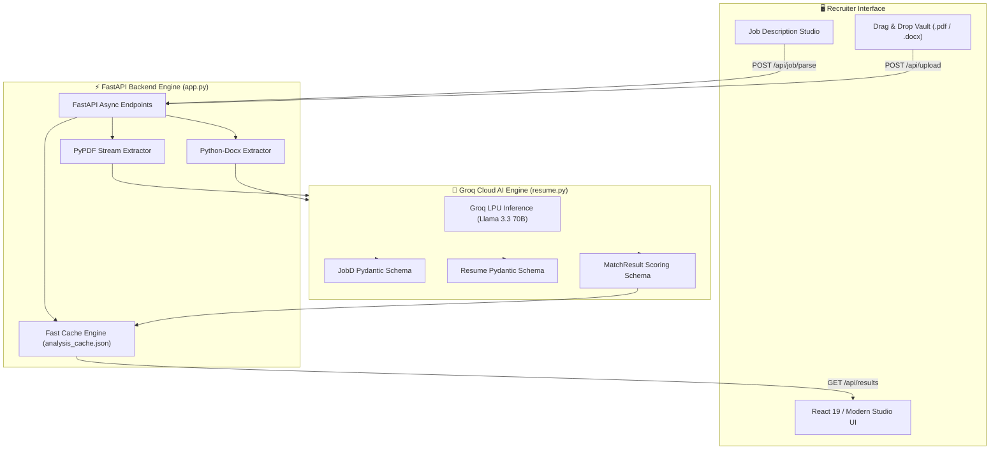

# 🎯 Resume Intelligence Studio (ResumeIntel)
### *Next-Gen AI Talent Screener & Deterministic ATS Match Engine*

[](https://resumeintel-3wdj.onrender.com/)
[](https://github.com/aditya-hariom/resumeintel)
[](LICENSE)

[](https://www.python.org/)
[](https://fastapi.tiangolo.com/)
[](https://react.dev/)
[](https://vitejs.dev/)
[](https://groq.com/)
[](https://docs.pydantic.dev/)

---

## 🌐 Live Deployment
Experience the live application deployed on Render:
👉 **[https://resumeintel-3wdj.onrender.com](https://resumeintel-3wdj.onrender.com/)**

---

## 📌 Executive Summary

Legacy Applicant Tracking Systems (ATS) rely on crude keyword searches and brittle regex filters, frequently rejecting qualified candidates while letting keyword-stuffed resumes through. 

**Resume Intelligence Studio (ResumeIntel)** solves this problem by combining **Groq Cloud's ultra-low-latency Llama 3.3 70B LLM** with **strict Pydantic v2 validation contracts**. The platform evaluates technical resumes (`.pdf` and `.docx`) against custom Job Descriptions (JDs) in sub-seconds, generating explainable, recruiter-grade match breakdowns with **zero hallucinations**.

---

## 🚀 Key Highlights & Capabilities

### 🎯 Dynamic Job Description Parsing
- Accepts any raw, unstructured job description.
- LLM extracts structured metadata: Target Role, Minimum Experience required, Core Required Skills, Preferred Skills, and Responsibilities into a strongly typed `JobD` schema.

### 📄 Multi-Format Resume Ingestion
- Native support for **PDF** (`pypdf`) and **Word DOCX** (`python-docx`).
- Extracts text from paragraphs, tables, and nested formatting gracefully with fallback handling for unreadable or image-only files.

### 🛡️ Deterministic Scoring & Zero-Hallucination Contracts
- Replaces open-ended LLM conversations with Groq's JSON Schema mode (`response_format={"type": "json_object"}`).
- Validated via Pydantic models (`CandidateScore`, `MatchResult`, `Resume`, `Experience`).
- Computes calibrated 0–100% match scores, matching skills, missing critical competencies, and experience checks.

### 📊 Recruiter Explainability & Bento Matrix
- **Radial Score Percentage Gauges**: Visual color-coded scoring indicators.
- **Competency Gap Analysis**: Side-by-side badges highlighting matching vs. missing skills.
- **Executive Verdict**: Concise recruiter summary evaluating candidate strengths and growth areas.
- **Slide-Over Candidate Inspector**: Deep-dive view of full candidate profile (contact info, work history, projects, certifications, and education).

### ⚡ Sub-Second Performance & Smart Caching
- Powered by Groq's LPU™ inference engine (~300+ tokens/sec).
- Integrated in-memory and persistent disk caching (`analysis_cache.json`) ensures re-inspections occur in $< 10\text{ ms}$.

### 🧹 Clean Slate & Interactive Demo Mode
- **Clean Slate on Boot**: Launches fresh for recruiter confidentiality; state, uploaded files, and evaluations auto-wipe on page refresh or via the "Reset Workspace" action.
- **One-Click Demo Sandbox**: Instant pre-loaded Amazon SDE-I role with 4 benchmarked candidates for immediate demonstration.

---

## 🏗️ Architecture & Data Pipeline



---

## 🛠️ Tech Stack & Dependencies

### Backend
| Technology | Purpose |
|---|---|
| **Python 3.11+** | Core runtime environment |
| **FastAPI** | High-performance asynchronous REST API framework |
| **Groq Cloud SDK** | High-speed LLM inference engine (`llama-3.3-70b-versatile`) |
| **Pydantic v2** | Data modeling, validation, and JSON schema enforcement |
| **PyPDF** | PDF text extraction engine |
| **python-docx** | Microsoft Word document parser |
| **Uvicorn** | Lightning-fast ASGI production web server |
| **python-dotenv** | Secure environment variable configuration |

### Frontend
| Technology | Purpose |
|---|---|
| **React 19** | Declarative component UI library |
| **Vite 6 / 8** | Modern, fast frontend build tooling |
| **Vanilla CSS3** | Custom design system, CSS Grid/Flexbox, Glassmorphism & Tokens |
| **Obsidian Dark Aesthetic** | Modern developer-first design language (`#08080a` obsidian base with `#10b981` emerald glow) |

---

## 📂 Repository Structure

```
resumeintel/
├── app.py                     # Main FastAPI server with endpoints & cache logic
├── resume.py                  # Core AI parsing engine, Groq client & Pydantic schemas
├── requirements.txt           # Python backend dependencies
├── pyproject.toml             # Project configuration and metadata
├── Procfile                   # Cloud deployment command (Render / Railway)
├── analysis_cache.json        # Persistent JSON evaluation cache
├── resumes/                   # Upload storage vault for candidate resumes
├── templates/
│   └── index.html             # High-aesthetic dark studio dashboard
├── static/
│   ├── css/                   # Design system tokens, styles, and animations
│   └── js/                    # Client logic, drawer controls, and API integrations
├── frontend/                  # React 19 + Vite modern client application
│   ├── src/                   # React components (BentoMatrix, Vault, Criteria)
│   ├── package.json           # Frontend dependencies and scripts
│   └── vite.config.js         # Vite configuration & proxy setup
├── .env.example               # Example environment variable file
└── README.md                  # Comprehensive project documentation
```

---

## 🚀 Quickstart & Local Setup

### Prerequisites
- **Python 3.11+** installed ([python.org](https://www.python.org/downloads/))
- **Node.js 18+** & npm (for React frontend)
- A **Groq Cloud API Key** (Free from [console.groq.com/keys](https://console.groq.com/keys))

---

### 1. Clone the Repository
```bash
git clone https://github.com/aditya-hariom/resumeintel.git
cd resumeintel
```

---

### 2. Configure Environment Variables
Create a `.env` file in the root directory:
```bash
# On Linux / macOS:
cp .env.example .env

# On Windows (PowerShell):
Copy-Item .env.example .env
```

Open `.env` and insert your Groq API key:
```env
GROQ_API_KEY=gsk_your_actual_groq_api_key_here
```

---

### 3. Backend Setup & Run

#### Set up a Virtual Environment:
```bash
# Create virtual environment
python -m venv .venv

# Activate virtual environment
# Windows (PowerShell):
.venv\Scripts\Activate.ps1
# Windows (CMD):
.venv\Scripts\activate.bat
# Linux / macOS:
source .venv/bin/activate
```

#### Install Dependencies:
```bash
pip install -r requirements.txt
```

#### Launch the Server:
```bash
uvicorn app:app --reload --port 8000
```
> 🚀 **FastAPI Server & Studio Dashboard live at:** [http://127.0.0.1:8000](http://127.0.0.1:8000)  
> 📖 **Interactive Swagger API Docs:** [http://127.0.0.1:8000/docs](http://127.0.0.1:8000/docs)  
> 📑 **ReDoc Documentation:** [http://127.0.0.1:8000/redoc](http://127.0.0.1:8000/redoc)

---

### 4. React 19 Frontend (Optional Development Server)
If you want to run the standalone React Vite development environment:

```bash
cd frontend
npm install
npm run dev
```
> 💻 **React Client live at:** [http://127.0.0.1:5173](http://127.0.0.1:5173)

---

## 📡 REST API Reference

| Method | Endpoint | Description | Request Body / Params |
|:---|:---|:---|:---|
| `GET` | `/` | Serves the interactive Resume Intelligence Studio | None |
| `GET` | `/api/job` | Fetch active Job Description and parsed criteria | None |
| `POST` | `/api/job/parse` | Parse and set new JD text with structured extraction | `{"job_description": "..."}` |
| `GET` | `/api/resumes` | List all resumes in vault with file stats & eval status | None |
| `POST` | `/api/upload` | Upload `.pdf` or `.docx` file and run instant scoring | `multipart/form-data` (`file`) |
| `DELETE`| `/api/resumes/{filename}`| Delete a resume from vault and invalidate its cache | Path parameter: `filename` |
| `GET` | `/api/results` | Fetch all evaluated candidates sorted by match score | None |
| `POST` | `/api/analyze` | Run batch evaluation across all uploaded resumes | `{"filenames": ["resume1.pdf"]}` *(optional)* |
| `GET` | `/api/demo-data` | Pre-loaded Amazon SDE-I job and 4 sample candidate evaluations | None |
| `POST` | `/api/reset` | Complete sandbox wipe (clears cache, JD, and uploaded files)| None |

---

## 🧠 Engineering Decisions & Architectural Trade-Offs

### 1. Why Groq Llama 3.3 70B instead of OpenAI GPT-4o?
- **Speed & Latency**: Groq LPUs deliver inference at **~300+ tokens/sec**, reducing resume parsing and scoring turnaround to $< 1.5\text{s}$ compared to $5\text{s} - 12\text{s}$ with standard cloud APIs.
- **Cost Efficiency**: High-quality open-weights models like Llama 3.3 70B match GPT-4-class semantic reasoning at a fraction of the token cost.

### 2. Strict Pydantic JSON Mode vs Free-form Prompts
- Free-form text prompts in recruiting workflows lead to non-deterministic responses, hallucinations, and unparseable layouts.
- By binding `response_format={"type": "json_object"}` to Pydantic v2 schemas (`JobD`, `Resume`, `MatchResult`), we guarantee strict JSON typing, deterministic score fields, and robust downstream frontend rendering.

### 3. Cache-First Evaluation Pipeline
- Resume evaluations can be computationally repetitive. ResumeIntel caches results by filename and job fingerprint in `analysis_cache.json`.
- Subsequent reads complete in **$< 10\text{ms}$**, eliminating redundant inference costs and API rate limits.

### 4. Resilient Document Streaming
- Formats like multi-column PDFs and Word tables often fail standard text extraction.
- We implement targeted extraction logic: `pypdf` extracts text page-by-page, while `python-docx` traverses both linear paragraphs and structured table cells to ensure no candidate credentials are lost.

---

## ☁️ Deployment Guide

### Deploying to Render
1. Create a new **Web Service** on [Render](https://render.com/).
2. Connect your GitHub repository: `https://github.com/aditya-hariom/resumeintel`.
3. Set the following build and start configurations:
   - **Environment**: `Python 3`
   - **Build Command**: `pip install -r requirements.txt`
   - **Start Command**: `uvicorn app:app --host 0.0.0.0 --port $PORT`
4. Add your Environment Variable in Render dashboard:
   - Key: `GROQ_API_KEY`
   - Value: `gsk_your_api_key_here`
5. Click **Deploy Web Service**.

---

## 🛣️ Roadmap & Future Enhancements

- [ ] **Automated Candidate Interview Questions**: Generate role-tailored technical questions based on detected missing competencies.
- [ ] **Hybrid Vector Search**: Implement ChromaDB / FAISS embeddings for semantic talent search across thousands of resumes.
- [ ] **One-Click Export**: Export candidate ranking matrices to CSV and PDF recruiter briefing packets.
- [ ] **GitHub & LinkedIn Enricher**: Cross-reference claimed resume projects with real GitHub commit histories.

---

## 🤝 Contributing

Contributions, issues, and feature requests are welcome!

1. Fork the Project (`git checkout -b feature/AmazingFeature`)
2. Commit your Changes (`git commit -m 'Add some AmazingFeature'`)
3. Push to the Branch (`git push origin feature/AmazingFeature`)
4. Open a Pull Request

---

## 📄 License

Distributed under the **MIT License**. See `LICENSE` for more information.

---

## 👨‍💻 Author

**Aditya Kumar**
- GitHub: [@aditya-hariom](https://github.com/aditya-hariom)
- Repository: [resumeintel](https://github.com/aditya-hariom/resumeintel)
